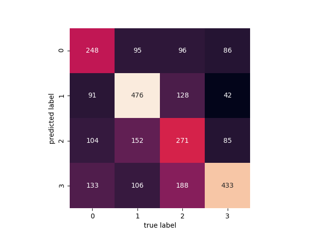

# Image classification of fruits

### To build an image classification system to classify 4 kinds of fruits: 
~~~
1. apple
2. orange
3. peach
4. pineapple
~~~

#### Install
~~~
pip3 install theano tensorflow keras
~~~

#### Data
~~~
1. Download and export URLs of images of each fruit type from ImageNet as txt
2. Run 01_dl_images.py to download the images
3. Run 02_trans_images.py to resize (128 x 128) and augment the images
4. Perform analysis on various models
~~~

#### Results

##### k-Nearest Neighbors
~~~
             precision    recall  f1-score   support

          0       0.53      0.41      0.46      1869
          1       0.64      0.66      0.65      2801
          2       0.48      0.47      0.47      2249
          3       0.58      0.69      0.63      2104

avg / total       0.57      0.57      0.57      9023

accuracy_score: 0.56965532528
~~~

##### Gaussian Naive Bayes
~~~
             precision    recall  f1-score   support

          0       0.42      0.35      0.38      1869
          1       0.58      0.65      0.61      2801
          2       0.39      0.24      0.30      2249
          3       0.47      0.65      0.55      2104

avg / total       0.47      0.49      0.47      9023

accuracy_score: 0.486091100521
~~~

