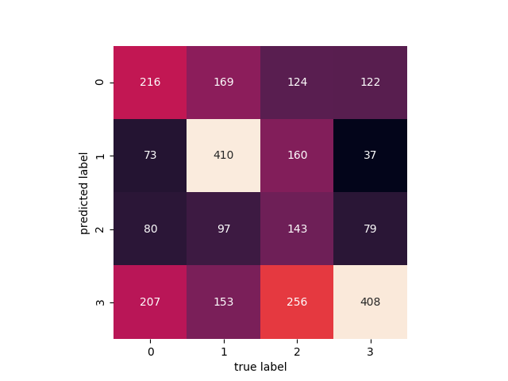

# Image classification of fruits

## To build an image classification system to classify 4 kinds of fruits: 
~~~
1. apple
2. orange
3. peach
4. pineapple
~~~

## Install
~~~
pip3 install theano tensorflow keras
~~~

## Data
~~~
1. Download and export URLs of images of each fruit type from ImageNet as txt
2. Run 01_dl_images.py to download the images
3. Run 02_trans_images.py to resize (128 x 128) and augment the image 
     3.1 x_train = Resize, Flip and/or Rotate
     3.2 x_test = Resize
4. Perform analysis on various models
~~~

## Results

### Principal component analysis 
* [pca_components.py](pca_components.py)

A vital part of using PCA in practice is the ability to estimate how many components are needed to describe the data. We can determine this by looking at the cumulative explained variance ratio as a function of the number of components.

### k-Nearest Neighbors
* [k-nn.py](k-nn.py)
~~~
             precision    recall  f1-score   support

          0       0.47      0.43      0.45       576
          1       0.65      0.57      0.61       829
          2       0.44      0.40      0.42       683
          3       0.50      0.67      0.58       646

avg / total       0.52      0.52      0.52      2734

accuracy_score: 0.522311631309
~~~

### Gaussian Naive Bayes
* [gnb.py](gnb.py)
~~~
             precision    recall  f1-score   support

          0       0.34      0.38      0.36       576
          1       0.60      0.49      0.54       829
          2       0.36      0.21      0.26       683
          3       0.40      0.63      0.49       646

avg / total       0.44      0.43      0.42      2734

accuracy_score: 0.430504754938
~~~

### Convolutional Neural Network (CNN) using Keras

#### Model Summary
~~~
_________________________________________________________________
Layer (type)                 Output Shape              Param #
=================================================================
conv2d_3 (Conv2D)            (None, 124, 124, 32)      2432
_________________________________________________________________
max_pooling2d_3 (MaxPooling2 (None, 62, 62, 32)        0
_________________________________________________________________
dropout_4 (Dropout)          (None, 62, 62, 32)        0
_________________________________________________________________
conv2d_4 (Conv2D)            (None, 58, 58, 64)        51264
_________________________________________________________________
max_pooling2d_4 (MaxPooling2 (None, 29, 29, 64)        0
_________________________________________________________________
dropout_5 (Dropout)          (None, 29, 29, 64)        0
_________________________________________________________________
flatten_2 (Flatten)          (None, 53824)             0
_________________________________________________________________
dense_3 (Dense)              (None, 128)               6889600
_________________________________________________________________
dropout_6 (Dropout)          (None, 128)               0
_________________________________________________________________
dense_4 (Dense)              (None, 4)                 516
=================================================================
Total params: 6,943,812
Trainable params: 6,943,812
Non-trainable params: 0
~~~
