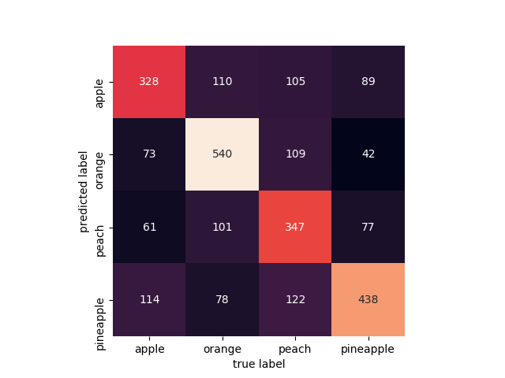

# Results

## Principal component analysis 
* [02_pca.py](./02_pca.py)

A vital part of using PCA in practice is the ability to estimate how many components are needed to describe the data. We can determine this by looking at the cumulative explained variance ratio as a function of the number of components.

## k-Nearest Neighbors
* [k-nn.py](k-nn.py)
~~~
             precision    recall  f1-score   support

          0       0.47      0.43      0.45       576
          1       0.65      0.57      0.61       829
          2       0.44      0.40      0.42       683
          3       0.50      0.67      0.58       646

avg / total       0.52      0.52      0.52      2734

accuracy_score: 0.522311631309
~~~
### Confusion Matrix

## Gaussian Naive Bayes
* [gnb.py](gnb.py)
~~~
             precision    recall  f1-score   support

          0       0.34      0.38      0.36       576
          1       0.60      0.49      0.54       829
          2       0.36      0.21      0.26       683
          3       0.40      0.63      0.49       646

avg / total       0.44      0.43      0.42      2734

accuracy_score: 0.430504754938
~~~
### Confusion Matrix

## Boosting Algorithms
* [06_boosting.py](06_boosting.py)
### AdaBoost
~~~
~~~

### Stochastic Gradient Boosting
~~~
~~~

## Bagging Algorithms
* [07_bagging.py](07_bagging.py)
### Bagged Decision Trees
~~~
             precision    recall  f1-score   support

          0       0.55      0.59      0.56       576
          1       0.72      0.68      0.70       829
          2       0.60      0.53      0.57       683
          3       0.62      0.70      0.66       646

avg / total       0.63      0.63      0.63      2734

Accuracy score:  0.628383321141
Precision score:  0.630897835309
Recall score:  0.628383321141
F1 score:  0.62809594008
~~~
### Confusion Matrix

### Random Forest
~~~
             precision    recall  f1-score   support

          0       0.47      0.52      0.50       576
          1       0.64      0.58      0.61       829
          2       0.49      0.43      0.46       683
          3       0.55      0.63      0.58       646

avg / total       0.54      0.54      0.54      2734

Accuracy score:  0.542062911485
Precision score:  0.544276773588
Recall score:  0.542062911485
F1 score:  0.541542739069
~~~
### Confusion Matrix

### Extra Trees
~~~
             precision    recall  f1-score   support

          0       0.42      0.47      0.45       576
          1       0.62      0.60      0.61       829
          2       0.44      0.34      0.38       683
          3       0.51      0.59      0.55       646

avg / total       0.51      0.51      0.50      2734

Accuracy score:  0.507315288954
Precision score:  0.506831941778
Recall score:  0.507315288954
F1 score:  0.504358756098
~~~

## Convolutional Neural Netwnork (CNN) using Keras
* [04_cnn.py](04_cnn.py)
### Model Summary
~~~
24606 train samples
2734 test samples
_________________________________________________________________
Layer (type)                 Output Shape              Param #
=================================================================
conv2d_1 (Conv2D)            (None, 126, 126, 32)      896
_________________________________________________________________
max_pooling2d_1 (MaxPooling2 (None, 63, 63, 32)        0
_________________________________________________________________
dropout_1 (Dropout)          (None, 63, 63, 32)        0
_________________________________________________________________
conv2d_2 (Conv2D)            (None, 61, 61, 32)        9248
_________________________________________________________________
max_pooling2d_2 (MaxPooling2 (None, 30, 30, 32)        0
_________________________________________________________________
dropout_2 (Dropout)          (None, 30, 30, 32)        0
_________________________________________________________________
flatten_1 (Flatten)          (None, 28800)             0
_________________________________________________________________
dense_1 (Dense)              (None, 64)                1843264
_________________________________________________________________
dropout_3 (Dropout)          (None, 64)                0
_________________________________________________________________
dense_2 (Dense)              (None, 4)                 260
=================================================================
Total params: 1,853,668
Trainable params: 1,853,668
Non-trainable params: 0
~~~

~~~
>>> print(y_test)
[0 0 0 ..., 3 3 3]
>>> print(y_pred)
[0 2 1 ..., 3 3 3]

             precision    recall  f1-score   support

          0       0.56      0.73      0.63       576
          1       0.75      0.56      0.64       683
          2       0.87      0.75      0.81       829
          3       0.79      0.93      0.85       646

avg / total       0.75      0.74      0.74      2734

Accuracy score:  0.740307242136
Precision score:  0.754531643345
Recall score:  0.740307242136
F1 score:  0.73908332645
~~~
### Confusion Matrix

