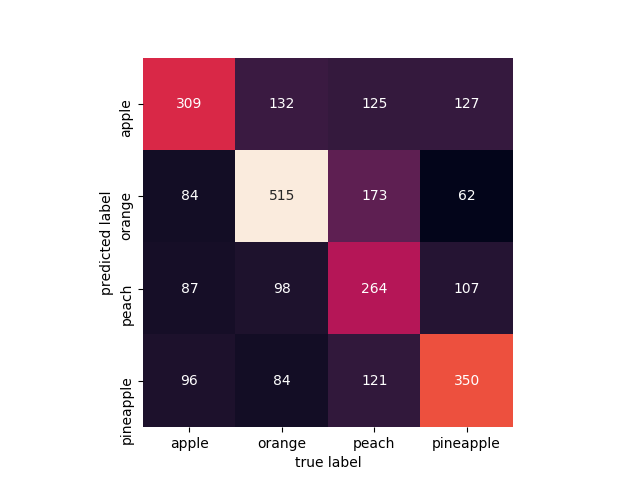

# Results

## 1. Principal component analysis 
* [02_pca.py](../02_pca.py)

A vital part of using PCA in practice is the ability to estimate how many components are needed to describe the data. We can determine this by looking at the cumulative explained variance ratio as a function of the number of components.

## 2. Gaussian Naive Bayes
* [03_gnb.py](../03_gnb.py)
~~~
             precision    recall  f1-score   support

          0       0.34      0.38      0.36       576
          1       0.60      0.49      0.54       829
          2       0.36      0.21      0.26       683
          3       0.40      0.63      0.49       646

avg / total       0.44      0.43      0.42      2734

Accuracy score:  0.430504754938
Precision score:  0.438619628064
Recall score:  0.430504754938
F1 score:  0.421662646121
~~~
### Confusion Matrix

## 3. Convolutional Neural Netwnork (CNN) using Keras
* [04_cnn.py](04_cnn.py)
### Model Summary
~~~
24606 train samples
2734 test samples
_________________________________________________________________
Layer (type)                 Output Shape              Param #
=================================================================
conv2d_1 (Conv2D)            (None, 126, 126, 32)      896
_________________________________________________________________
max_pooling2d_1 (MaxPooling2 (None, 63, 63, 32)        0
_________________________________________________________________
dropout_1 (Dropout)          (None, 63, 63, 32)        0
_________________________________________________________________
conv2d_2 (Conv2D)            (None, 61, 61, 32)        9248
_________________________________________________________________
max_pooling2d_2 (MaxPooling2 (None, 30, 30, 32)        0
_________________________________________________________________
dropout_2 (Dropout)          (None, 30, 30, 32)        0
_________________________________________________________________
flatten_1 (Flatten)          (None, 28800)             0
_________________________________________________________________
dense_1 (Dense)              (None, 64)                1843264
_________________________________________________________________
dropout_3 (Dropout)          (None, 64)                0
_________________________________________________________________
dense_2 (Dense)              (None, 4)                 260
=================================================================
Total params: 1,853,668
Trainable params: 1,853,668
Non-trainable params: 0
~~~

~~~
>>> print(y_test)
[0 0 0 ..., 3 3 3]
>>> print(y_pred)
[0 2 1 ..., 3 3 3]

             precision    recall  f1-score   support

          0       0.54      0.71      0.61       576
          1       0.82      0.81      0.81       829
          2       0.78      0.39      0.51       683
          3       0.75      0.94      0.83       646

avg / total       0.73      0.71      0.70      2734

Accuracy score:  0.712874908559
Precision score:  0.731028282706
Recall score:  0.712874908559
F1 score:  0.700299616223
~~~
### Confusion Matrix

## 4. k-Nearest Neighbors
* [k-nn.py](../05_knn.py)
~~~
best params:  {'n_neighbors': 6, 'weights': 'distance'}
Results for knn
             precision    recall  f1-score   support

          0       0.45      0.44      0.44       576
          1       0.65      0.57      0.61       829
          2       0.45      0.42      0.44       683
          3       0.52      0.65      0.58       646

avg / total       0.53      0.53      0.52      2734

Accuracy score:  0.525237746891
Precision score:  0.528060114425
Recall score:  0.525237746891
F1 score:  0.52432058499
~~~
### Confusion Matrix

## 5. Boosting Algorithms
* [06_boosting.py](06_boosting.py)
### AdaBoost
~~~
             precision    recall  f1-score   support

          0       0.35      0.25      0.29       576
          1       0.66      0.47      0.55       829
          2       0.33      0.38      0.36       683
          3       0.37      0.54      0.44       646

avg / total       0.44      0.42      0.42      2734

Accuracy score:  0.416971470373
Precision score:  0.443021826763
Recall score:  0.416971470373
F1 score:  0.418820044314
~~~

### Stochastic Gradient Boosting
~~~
             precision    recall  f1-score   support

          0       0.42      0.21      0.28       576
          1       0.62      0.53      0.57       829
          2       0.36      0.32      0.34       683
          3       0.41      0.71      0.52       646

avg / total       0.46      0.45      0.44      2734

Accuracy score:  0.452084857352
Precision score:  0.46133604222
Recall score:  0.452084857352
F1 score:  0.438013617315
~~~

## 6. Bagging Algorithms
* [07_bagging.py](07_bagging.py)
### Bagged Decision Trees
~~~
             precision    recall  f1-score   support

          0       0.27      0.32      0.30       576
          1       0.43      0.42      0.43       829
          2       0.30      0.26      0.28       683
          3       0.35      0.36      0.36       646

avg / total       0.35      0.35      0.35      2734

Accuracy score:  0.345647403072
Precision score:  0.347278774746
Recall score:  0.345647403072
F1 score:  0.345614306097

Confusion matrix:  
[[185 129 110 152]
 [163 349 187 130]
 [155 202 177 149]
 [172 129 111 234]]
~~~
### Confusion Matrix

### Random Forest
~~~
             precision    recall  f1-score   support

          0       0.47      0.52      0.50       576
          1       0.64      0.58      0.61       829
          2       0.49      0.43      0.46       683
          3       0.55      0.63      0.58       646

avg / total       0.54      0.54      0.54      2734

Accuracy score:  0.542062911485
Precision score:  0.544276773588
Recall score:  0.542062911485
F1 score:  0.541542739069

Confusion matrix:  
[[299  80  82 115]
 [132 483 130  84]
 [111 139 296 137]
 [ 88  55  99 404]]
~~~
### Confusion Matrix

### Extra Trees
~~~
             precision    recall  f1-score   support

          0       0.42      0.47      0.45       576
          1       0.62      0.60      0.61       829
          2       0.44      0.34      0.38       683
          3       0.51      0.59      0.55       646

avg / total       0.51      0.51      0.50      2734

Accuracy score:  0.507315288954
Precision score:  0.506831941778
Recall score:  0.507315288954
F1 score:  0.504358756098

Confusion matrix:  
[[273  99  87 117]
 [119 500 112  98]
 [144 150 232 157]
 [112  54  98 382]]
~~~

